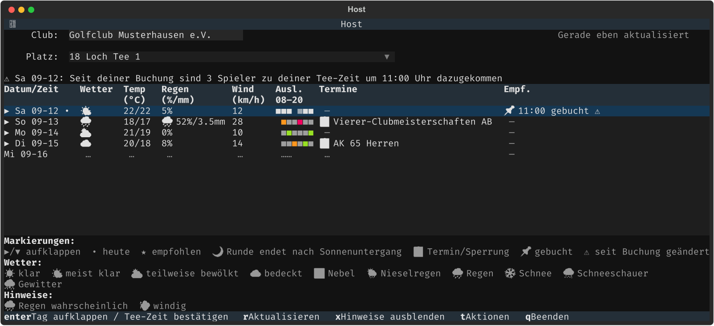
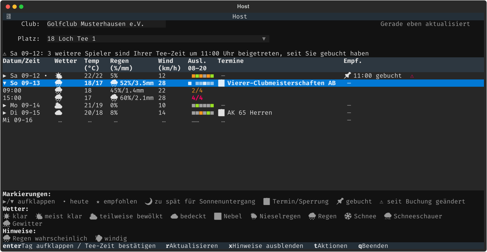
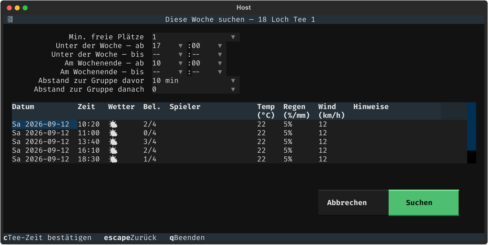
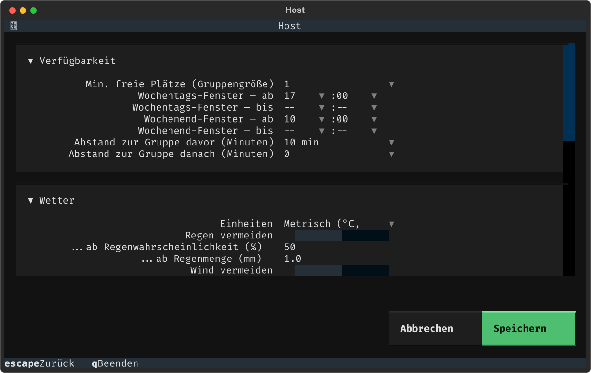
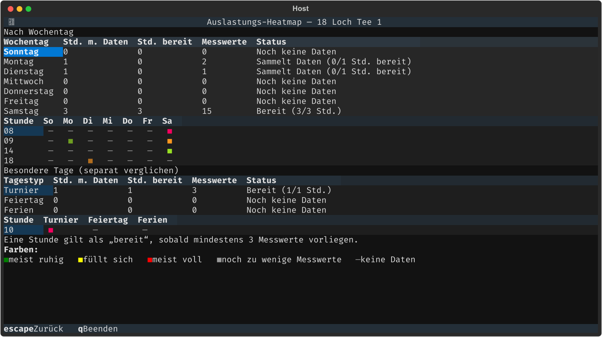
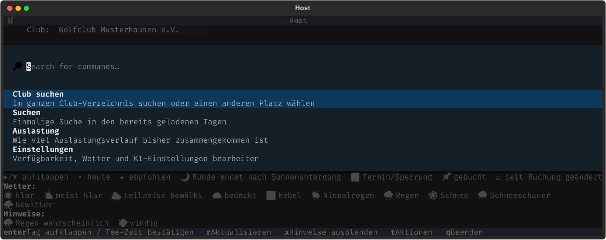

<h1 align="center">teetime-monitor</h1>

<p align="center">
  <strong>Die Zeitbuchung deines Clubs ist öffentlich einsehbar. Sie immer wieder von Hand zu prüfen, ist es nicht.</strong><br>
  Eine schnelle Terminal-Ansicht der Tee-Zeiten eines pc-caddie-Clubs — mit Wetter, Auslastungsverlauf
  und deinen eigenen Buchungsregeln, im Hintergrund automatisch aktualisiert.
</p>

<p align="center">
  <a href="https://github.com/ltdan-88/teetime-monitor/releases"></a>
  <a href="LICENSE"></a>
  
  
</p>

<p align="center"><a href="README.md">🇬🇧 English</a> · 🇩🇪 <strong>Deutsch</strong></p>

<p align="center"></p>

## Warum es das gibt

Die eigene Web-Ansicht von pc caddie funktioniert grundsätzlich — das Problem ist,
sie ständig zu prüfen. Eine Zeit neben deiner bestehenden Buchung wird frei, die
Vorhersage für deine Runde verschlechtert sich, oder drei Wochen im Voraus öffnet
sich plötzlich etwas — nichts davon fällt auf, außer man schaut zufällig noch einmal
im Browser nach.

`teetime-monitor` spiegelt die Tee-Zeiten deines Clubs in eine Terminal-Tabelle, die
sich im Hintergrund selbst aktualisiert, ergänzt Wetter-, Tageslicht- und
Auslastungskontext, den die Seite selbst nicht zeigt, und meldet sich, wenn sich an
einer bereits getätigten Buchung etwas ändert — ohne offenen Browser-Tab, ohne eine
Seite, an deren Neuladen man denken muss.

## Schnellstart

```bash
brew install ltdan-88/teetime-monitor/teetime-monitor
teetime-monitor
```

Das war's — startet auf der Club-Suche (oder direkt beim zuletzt geöffneten
Club/Platz, sobald einmal einer gewählt wurde). Club-ID eintippen, den Buchungslink
einfügen, oder suchen, sobald das Verzeichnis einmal geladen ist — schon ist man auf
der Zeitbuchung.

**Voraussetzungen:** macOS oder Linux · [Homebrew](https://brew.sh/) · ein einmaliger
Playwright-Chromium-Download (nur für den Login bei pc caddie nötig — die
öffentliche Zeitbuchung selbst braucht ihn nie). Ein pc-caddie-Login ist optional:
nur zum Herunterladen des durchsuchbaren Club-Verzeichnisses und zum automatischen
Auslesen eigener bestätigter Reservierungen — eine eingetippte Club-ID, Favoriten
und die Zeitbuchung selbst funktionieren auch ohne. Optional: ein
[Anthropic](https://www.anthropic.com/)-API-Key, nur falls KI-bewertete Empfehlungen
eingeschaltet werden (standardmäßig aus).

## Was man bekommt

### Die mehrtägige Übersicht

Der Startbildschirm, sobald ein Club gewählt ist: eine Zeile pro Tag, für den
gerade tatsächlich gebucht werden kann — echtes Wetter, ein sechsteiliger
Auslastungsbalken für 08:00–20:00 Uhr, Termine/Sperrungen dieses Tages, und eine
**Empfehlung** — eine bestätigte Buchung, die empfohlene Zeit, oder wieso keine
infrage kommt.

**Enter** klappt einen Tag direkt an Ort und Stelle auf, in seine eigenen
Zeitfenster-Zeilen; **Enter** erneut auf einer Zeit bestätigt sie — oder bietet,
falls es bereits die eigene bestätigte Buchung ist, an, sie stattdessen lokal als
storniert zu markieren.

<p align="center"></p>

### Wetter & Spielbarkeit

[Open-Meteo](https://open-meteo.com/), kein API-Key nötig, aufgeteilt in eigene
Spalten für Wetter / Temperatur / Regen / Wind — echte Zahlen immer sichtbar, nicht
erst ab einem Schwellenwert hinter einem Icon versteckt. Ein 🌙 markiert jede
Tee-Zeit, die vor Einbruch der Dunkelheit nicht mehr fertiggespielt würde, basierend
auf dem eigenen geschätzten Tempo für eine 9- oder 18-Loch-Runde.

### Behält bereits getätigte Buchungen im Blick

Bestätigte Reservierungen werden automatisch von pc caddies eigener Seite "Meine
Reservierungen" ausgelesen — teetime-monitor bucht oder storniert selbst nie etwas
auf der echten Seite. Ändert sich etwas — jemand kommt zur Flight dazu, eine
Nachbarzeit füllt sich und verkleinert den eigenen Puffer, die Vorhersage für den
Tag verschlechtert sich — erscheint beim nächsten Start ein Hinweis (siehe den ganz
oben im Übersichts-Screenshot). **x** blendet ihn aus.

### Suche für Ausnahmefälle

Die gespeicherte Verfügbarkeit deckt den üblichen Fall ab; **Suchen** (aus Aktionen)
ist für die Ausnahme — "nur heute, 3 Spieler, ab 15:00 Uhr" — vorausgefüllt aus den
eigenen gespeicherten Vorgaben, sodass nur eine Sache angepasst wird, nicht alles
neu eingetippt werden muss. Geprüft gegen jeden bereits geladenen Tag, ohne neuen
Abruf, mit demselben Wetter-/Tageslicht-Check und optionaler KI-Bewertung wie die
automatischen Empfehlungen.

<p align="center"></p>

### Eigene Regeln, automatisch angewendet

Die eigene Standard-Verfügbarkeit einmal festlegen — Gruppengröße,
Wochentags-/Wochenend-Zeitfenster, Puffer zu Nachbarflights — und passende Zeiten
bekommen in der Übersicht automatisch einen ★, ohne jedes Mal neu suchen zu müssen.
Global, nicht pro Club: die eigene Verfügbarkeit und Wetterpräferenz ändern sich
schließlich nicht je nach geprüftem Platz.

**KI-bewertete Empfehlungen** (Einstellungen → KI-Bewertung) lassen Claude die beste
aus einer bereits gefilterten Vorauswahl wählen, statt einfach die früheste
passende Zeit. Standardmäßig aus — es ist ein echter, kostenpflichtiger API-Aufruf
pro Empfehlung, keine kostenlose Zusatzfunktion. Einstellungen deckt außerdem das
eigene geschätzte Tempo für 9/18 Loch und das Scrape-Intervall ab, in aufklappbare
Abschnitte gruppiert statt von Hand editierter YAML.

<p align="center"></p>

### Eine Auslastungs-Heatmap

Historische Auslastung nach tatsächlichem Wochentag gruppiert, plus ein separater
Vergleich für Turnier-/Feiertags-/Ferientage, damit ein zukünftiger
Ferienwochen-Montag mit anderen Ferientagen verglichen wird, nicht mit gewöhnlichen
Montagen. Über dem eigentlichen farbigen Raster steht eine Datenstand-Tabelle (wie
viele Stunden Verlauf jeder Wochentag/Tagtyp schon hat) — im Raster selbst Stunde
für Stunde als Zeile, Wochentag oder Tagtyp als Spalte: ein voll eingefärbtes Feld,
sobald eine Stunde genug Messwerte hat, dasselbe Feld gedimmt, solange noch zu
wenige vorliegen, leer, wo noch gar nichts erfasst wurde.

<p align="center"></p>

### Ein Menü führt alles zusammen

**t** (oder **ctrl+p**) öffnet **Aktionen**: **Club suchen** (das gesamte
pc-caddie-Verzeichnis durchsuchen, oder direkt zu einer Club-ID springen),
**Suchen**, **Auslastung** und **Einstellungen** — dazu Design, Sprache und
Textuals eigene Werkzeuge, alle vollständig übersetzt und mit den eigenen Aktionen
dieser App zuerst angeordnet.

<p align="center"></p>

Zwei Dropdown-Menüs direkt über der Tabelle wechseln zwischen bereits favorisierten
Clubs/Plätzen, ganz ohne ein Menü zu öffnen — Aktionen ist für einen noch nicht
gespeicherten Club, oder für alles, was keine eigene Taste hat.

### Zweisprachig, mit Themes

Jeder Bildschirm — Tabellenüberschriften, Fußzeilen-Tastenhinweise, Hinweise, das
Aktionen-Menü selbst — funktioniert auf Englisch oder Deutsch, jederzeit über
Aktionen umschaltbar. Startet auf Deutsch, wenn die Systemsprache danach aussieht.
Zehn Farbthemes (dieselbe Palette, die auch
[`brew-launcher`](https://github.com/ltdan-88/brew-launcher) verwendet), genauso
umschaltbar.

## Referenz

| Taste | Aktion | Wo |
|---|---|---|
| **Enter** | Tag direkt aufklappen / markierte Tee-Zeit bestätigen oder stornieren | Übersicht |
| **r** | Das gesamte geladene Fenster sofort aktualisieren, unabhängig vom üblichen Intervall | Übersicht |
| **x** | Buchungs-Hinweise ausblenden | Übersicht |
| **t** / **ctrl+p** | **Aktionen** öffnen — Club suchen, Suchen, Auslastung, Einstellungen, Sprache, Design und Textuals eigene Werkzeuge | Übersicht |
| **q** | Beenden | überall |
| **Esc** | Zurück — kehrt zu Aktionen zurück, falls der aktuelle Bildschirm von dort geöffnet wurde, sonst zur Übersicht | jeder Bildschirm aus Aktionen |
| **f** | Favorit für den markierten Club umschalten | Club-Suche |
| **r** | Das zwischengespeicherte Club-Verzeichnis aktualisieren | Club-Suche |
| **l** | Eigenen pc-caddie-Login einrichten oder bearbeiten | Club-Suche |
| **c** | Markiertes Suchergebnis bestätigen | Suche |

`teetime-monitor --version` (oder `-v`) gibt die installierte Version aus und
beendet sich — sie steht außerdem die ganze Laufzeit über im Kopfbereich der App.

## Konfiguration

Nichts davon ist Pflicht — `brew install` + `teetime-monitor` funktioniert ohne
jede Einrichtung. Für geplantes Hintergrund-Scraping, club-eigene Angaben und wo
alles gespeichert wird: hier aufklappen.

<details>
<summary><strong>Konfigurationsdetails anzeigen</strong></summary>

Wie bei `terraform`/`docker-compose` liest die App ihren eigenen Zustand aus dem
Verzeichnis, in dem sie gestartet wird — eines wählen und immer von dort aus
starten.

```
.env                                          # PCC_USER / PCC_PASS / ANTHROPIC_API_KEY -- in .gitignore
clubs/<eigene-club-id>.yaml                   # pro Club: location, overview_days, default_course, identity
~/.config/teetime-monitor/preferences.yaml    # Verfügbarkeit/Wetter-Regeln, KI-Bewertung, Rundentempo, Scrape-Intervall -- global
~/.config/teetime-monitor/config              # THEME=, LANG= -- ebenfalls global
```

`python -m src.credentials_screen` setzt `PCC_USER`/`PCC_PASS` aus der Oberfläche
heraus (legt `.env` aus `.env.example` an, falls noch keine existiert —
`ANTHROPIC_API_KEY` danach von Hand ergänzen). `r`/`l` in der laufenden App öffnen
denselben Bildschirm direkt dort, wo er gebraucht wird. Ein pc-caddie-Login deckt
jeden Club unter demselben Konto ab — die seltenere clubweise Ausnahme
(`PCC_USER__<club-id>`) ist in `.env.example` dokumentiert.

`f` in der App schreibt eine minimale `clubs/<id>.yaml`; `clubs/club.example.yaml`
darüberkopieren für die vollständig kommentierte Version (Wetter-Koordinaten,
Feiertags-Ländercode, von Hand eingetragene Ferienzeiträume). Standard-Verfügbarkeit,
KI-Bewertung und Scrape-Intervall werden über **Aktionen → Einstellungen**
bearbeitet (oder eigenständig via `python -m src.settings_screen`) — eine
gemeinsame Datei, da sich keines davon tatsächlich je nach Club unterscheidet.

### Verlauf auch dann weiterführen, wenn niemand hinschaut

Die laufende App scraped automatisch — einmal beim Öffnen, und danach regelmäßig,
solange sie läuft — aber pc caddie verbirgt vergangene Zeitbuchungen vollständig,
sodass jeder Tag, an dem niemand die App öffnet, sonst eine dauerhafte Lücke
hinterlässt. Um auch unbeaufsichtigt zu scrapen (macOS, via `launchd`, alle 15
Minuten geprüft, pro Club selbst gedrosselt nach dessen eigenem Intervall):

```bash
cat > ~/Library/LaunchAgents/com.teetimemonitor.scrape.plist <<'EOF'
<?xml version="1.0" encoding="UTF-8"?>
<!DOCTYPE plist PUBLIC "-//Apple//DTD PLIST 1.0//EN" "http://www.apple.com/DTDs/PropertyList-1.0.dtd">
<plist version="1.0">
<dict>
    <key>Label</key><string>com.teetimemonitor.scrape</string>
    <key>ProgramArguments</key>
    <array>
        <string>/pfad/zu/teetime-monitor/.venv/bin/python</string>
        <string>-m</string><string>src.scrape_once</string>
    </array>
    <key>WorkingDirectory</key><string>/pfad/zu/teetime-monitor</string>
    <key>StartInterval</key><integer>900</integer>
    <key>RunAtLoad</key><true/>
    <key>StandardOutPath</key><string>~/Library/Logs/teetime-monitor.log</string>
    <key>StandardErrorPath</key><string>~/Library/Logs/teetime-monitor.log</string>
</dict>
</plist>
EOF
launchctl load ~/Library/LaunchAgents/com.teetimemonitor.scrape.plist
```

Kontrolle über `cat ~/Library/Logs/teetime-monitor.log` (leer bedeutet keine
Fehler); später entfernen mit `launchctl unload ...` plus Löschen der plist-Datei.

### Stattdessen aus dem Quellcode

```bash
pip install -e .
python -m src.tui
```

</details>

## Projektstruktur

<details>
<summary><strong>Modul-Übersicht anzeigen</strong></summary>

```
teetime-monitor/
├── README.md / README.de.md
├── ROADMAP.md                    # vollständige, phasenweise Entstehungsgeschichte
├── pyproject.toml
├── .env.example
├── clubs/
│   └── club.example.yaml         # Vorlage -- pro echtem Club kopieren (echte sind in .gitignore)
├── docs/
│   ├── spec-v1.md                # ursprüngliche Spezifikation (historisch)
│   └── pccaddie-markup-notes.md  # Beispiel-HTML der echten Seite
├── src/
│   ├── tui.py                    # die App selbst -- Club-Suche, Übersicht, Suche, Heatmap, Einstellungen
│   ├── scraper.py                # direkter Abruf, Login, Parsing der Zeitbuchung
│   ├── scrape_once.py            # geplantes Scraping, Intervall pro Club, Abgleich mit "Meine Reservierungen"
│   ├── storage.py                # SQLite-Persistenz
│   ├── search.py / recommend.py  # harte Filter, danach Wetter/Tageslicht + KI-Bewertung
│   ├── ai_assist.py              # die drei Claude-API-Aufrufe (Klassifikation, Bewertung, Zusammenfassung)
│   ├── weather.py                # Open-Meteo-Client
│   ├── booking_watch.py          # hat sich an einer bestätigten Buchung etwas geändert?
│   ├── playability.py            # ist eine Tee-Zeit vor Sonnenuntergang noch spielbar?
│   ├── analytics.py              # Auslastungs-Heatmap + Datenstand
│   ├── calendar_context.py       # Feiertage + Ferienzeiträume -> Tagtyp
│   ├── settings_screen.py        # gemeinsamer Einstellungsbildschirm (aus der App oder eigenständig)
│   ├── credentials_screen.py     # gemeinsamer Login-Bildschirm (aus der App oder eigenständig)
│   ├── club_config.py            # Favoriten: clubs/*.yaml laden/speichern
│   ├── club_directory.py         # zwischengespeichertes pc-caddie-Verzeichnis + ID-Erkennung
│   ├── geocode.py                # Best-Effort-Standortsuche für einen neuen Club
│   ├── global_preferences.py     # gemeinsame Datei für Verfügbarkeit/KI/Tempo/Intervall
│   ├── theme.py / i18n.py        # 10 Farbthemes; englische/deutsche UI-Texte
│   ├── user_config.py            # gemeinsame THEME=/LANG=-Konfigurationsdatei
│   ├── units.py                  # Umrechnung metrisch/imperial
│   ├── env_file.py                # .env an Ort und Stelle lesen/schreiben
│   ├── translated_footer.py      # gemeinsames zweisprachiges Fußzeilen-Widget
│   └── models.py                 # Slot / Schedule / WeatherPoint / ConfirmedBooking / ...
└── tests/                        # eine Datei pro obigem Modul, plus test_tui.py
```

</details>

## Problembehebung

**„No tee sheet found" für einen Club, den es wirklich gibt.** Manche Clubs
veröffentlichen einfach keine über pc caddie — sowohl `scrape_once` als auch die
Übersicht melden das sauber, statt einen Fehler zu werfen. Die Club-ID gegen den
eigenen Buchungslink prüfen.

**Wetter sieht falsch aus, oder fehlt.** Die Koordinaten des Clubs stammen aus
einer Best-Effort-Nominatim-Suche nach dem Clubnamen, nach dem ersten Abruf
zwischengespeichert — nicht immer exakt der Clubhaus-Pin. `location:` in
`clubs/<id>.yaml` von Hand für eine exakte Korrektur bearbeiten.

**KI-bewertete Empfehlungen tun nichts.** Sie sind standardmäßig aus
(Einstellungen → KI-Bewertung) und brauchen so oder so `ANTHROPIC_API_KEY` in
`.env` — ohne Key schlägt das Einschalten bei der nächsten Empfehlung einfach
stillschweigend fehl.

**Eine bestätigte Buchung taucht nicht auf.** Sie wird bei jedem geplanten Scrape
von pc caddies eigener Seite "Meine Reservierungen" gelesen, nicht in Echtzeit —
**r** (Aktualisieren) in der Übersicht erzwingt es sofort. Eine Stornierung auf der
echten Seite wird beim nächsten Abgleich genauso automatisch erkannt.

**Beim ersten Öffnen eines Clubs passiert nichts — hängt es?** Sowohl das
Club-Verzeichnis als auch die Zeitbuchung selbst brauchen beim ersten Mal einen
Live-Abruf; eine langsame Verbindung oder ein träger pc-caddie-Server können diesen
ersten Ladevorgang ein paar Sekunden dauern lassen. „Refreshing…" oben rechts zeigt,
dass tatsächlich etwas passiert.

## Zugangsdaten & Daten

`.env` steht in `.gitignore` — `PCC_USER`/`PCC_PASS`/`ANTHROPIC_API_KEY` werden
nirgends fest einprogrammiert oder irgendwohin gesendet außer an pc caddies eigenes
Login-Formular bzw. Anthropics API. Ein pc-caddie-Login deckt jeden unter demselben
Konto gespeicherten Club ab. Club-eigene Dateien unter `clubs/` stehen ebenfalls in
`.gitignore`, bis auf die versionierte Vorlage `club.example.yaml` — nur `location`,
`overview_days`, `default_course` und `identity` liegen dort überhaupt; alles
andere (Verfügbarkeit, KI-Bewertung, Scrape-Intervall, Design, Sprache) ist
gemeinsam und global, siehe [Konfiguration](#konfiguration) oben.

## Lizenz

[MIT](LICENSE)
