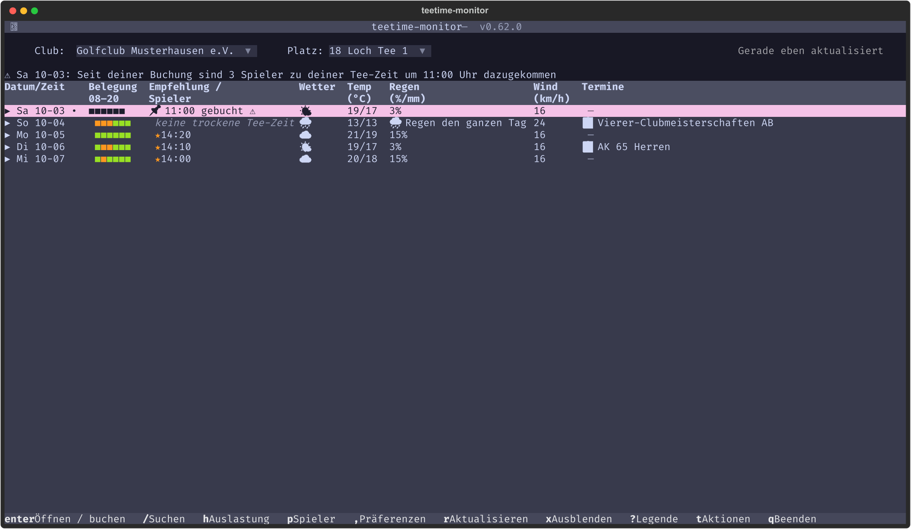
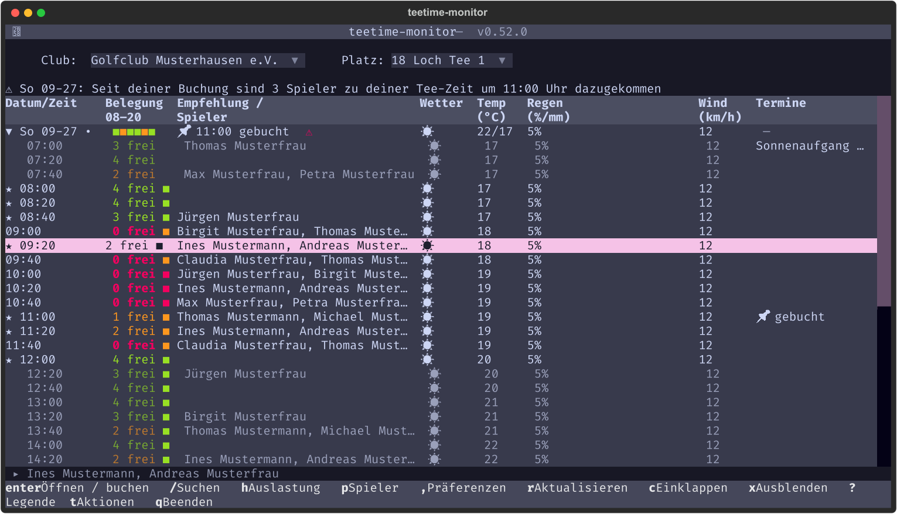
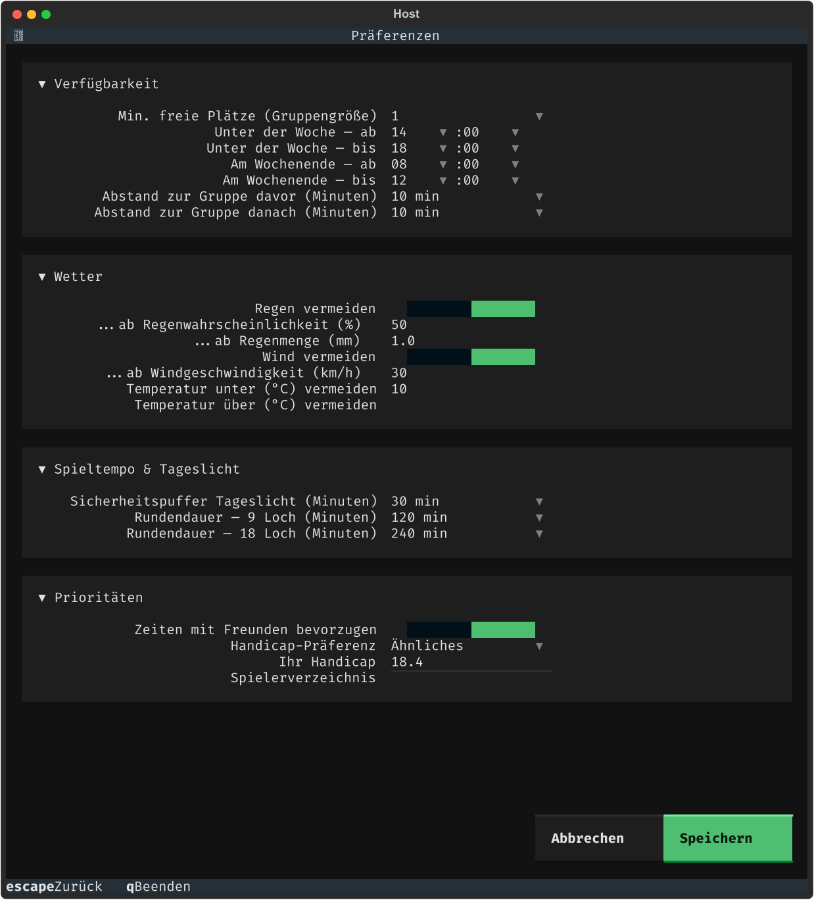
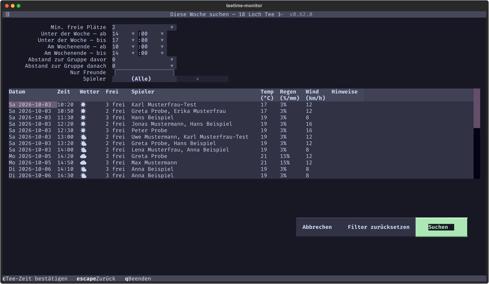
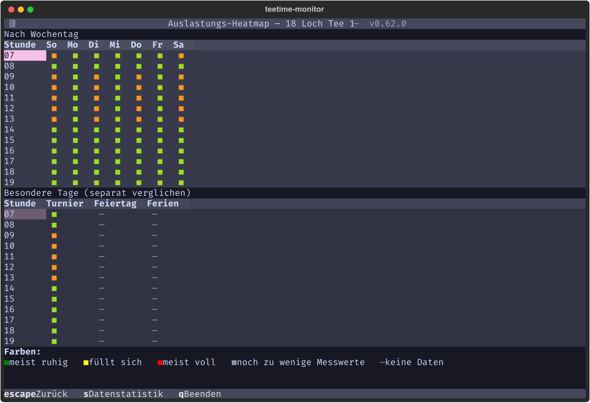
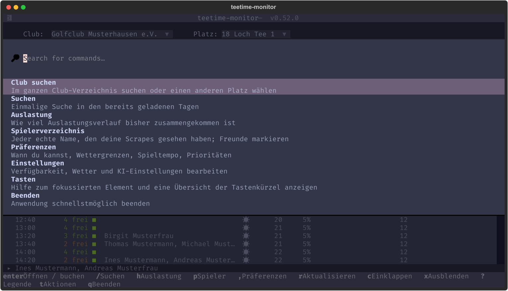
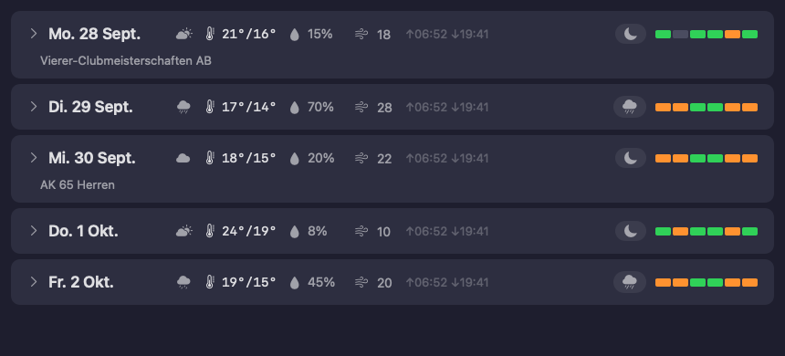
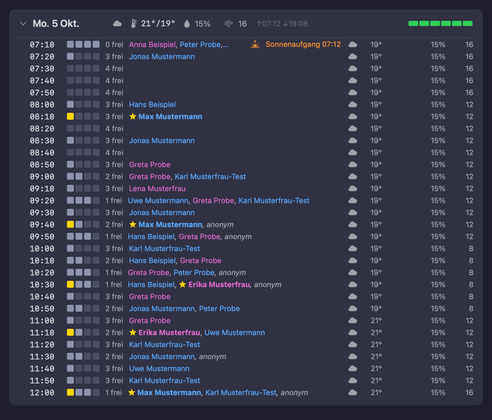

<h1 align="center">teetime-monitor</h1>

<p align="center">
  <strong>Eine Tee-Zeit zu buchen dauert eine Minute. Die richtige zu finden die ganze Woche.</strong><br>
  Die Startliste deines Golfclubs im Terminal — hält sich selbst aktuell, rechnet Wetter,
  Tageslicht und deine eigenen Vorgaben gleich mit ein und markiert die Zeit, die sich
  lohnt, bevor du überhaupt suchst.
</p>

<p align="center">
  <a href="https://github.com/ltdan-88/teetime-monitor/releases"></a>
  <a href="LICENSE"></a>
  
  
</p>

<p align="center"><a href="README.md">🇬🇧 English</a> · 🇩🇪 <strong>Deutsch</strong></p>

<p align="center"></p>

## Worum es geht

Golfclubs im deutschsprachigen Raum veröffentlichen ihre Startlisten — wer auf
welcher Zeit steht, welche Zeiten noch frei sind — über die Buchungsplattform
**pc caddie**. Diese Listen sind öffentlich, zum Lesen braucht es keinen Login.

`teetime-monitor` liest genau diese Liste und bringt sie ins Terminal. Im Hintergrund
ruft er sie regelmäßig neu ab, ergänzt, was auf der Clubseite selbst fehlt — die
Vorhersage für die einzelne Startzeit, ob die Runde vor Einbruch der Dunkelheit noch
fertig wird, wie voll dieser Wochentag erfahrungsgemäß ist — und hebt die Zeiten
hervor, die zu den Vorgaben passen, die du einmal hinterlegt hast.

**Gebucht wird nichts.** Das Buchen bleibt auf der pc-caddie-Seite. Hier geht es um
den Schritt davor: die passende Zeit überhaupt zu finden — und mitzubekommen, wenn
sich an ihr etwas ändert.

## Wie man damit arbeitet

1. **Starten.** Du landest auf den nächsten buchbaren Tagen, einer pro Zeile.
2. **Spalte „Empfehlung" lesen.** Jeder Tag sagt bereits, was Sache ist: eine empfohlene
   Zeit mit ★, deine bestätigte Buchung, oder warum dort nichts infrage kommt
   („zu dunkel zum Fertigspielen", „keine trockene Tee-Zeit"). Ist es auf deinem
   Platz zu dunkel, aber auf einem kürzeren Platz des Clubs passt noch eine Runde,
   schlägt die Zelle diese vor — z. B. „★ 16:10 · 9L" (die TUI nennt den Platz unter
   der Tabelle, sobald der Tag markiert ist; in der GUI zeigt ihn der Tooltip, und ein
   Klick wechselt auf diesen Platz).
3. **Enter auf einem Tag** klappt dessen Startzeiten direkt auf; Enter auf einer Zeit
   markiert sie als deine, sobald du sie auf pc caddie gebucht hast.
4. **Laufen lassen.** Der Rest passiert im Hintergrund. Kommt jemand in deinen Flight,
   füllt sich die Zeit direkt daneben, oder dreht die Vorhersage für deine Runde,
   wartet beim nächsten Start ein Hinweis auf dich.

## Schnellstart

```bash
brew install ltdan-88/teetime-monitor/teetime-monitor
teetime-monitor
```

Solange kein Login eingerichtet ist, öffnet sich zuerst die pc-caddie-Anmeldung —
**Escape** überspringt sie. Dann den Club nach Namen suchen, die Club-ID eintippen oder
den pc-caddie-Buchungslink einfügen — fertig, die Startliste steht da. Ein Konto
braucht es nicht: die Startliste ist öffentlich.

<details>
<summary><strong>Was optional dazukommt — und wofür</strong></summary>

Alles oben funktioniert ohne jede dieser Zutaten. Jede bringt nur etwas dazu:

| Zusatz | Bringt |
|---|---|
| pc-caddie-Login (`l` in der Club-Suche) | Das Live-Clubverzeichnis aktualisieren (eine mitgelieferte Momentaufnahme lässt sich auch ohne Login nach Namen durchsuchen), eigene Buchungen und Handicap automatisch übernehmen, echte Spielernamen (falls dein Club sie teilt), ein durchsuchbares Spielerverzeichnis, und Zeiten mit Freunden oder ähnlichem/besserem Handicap bevorzugen |
| API-Key eines KI-Anbieters ([Anthropic](https://www.anthropic.com/), OpenAI, Gemini oder Grok) | KI-bewertete Empfehlungen (standardmäßig aus, kostenpflichtig pro Empfehlung) |

**Voraussetzungen:** macOS oder Linux und [Homebrew](https://brew.sh/). Die Terminal-App läuft
auch unter Windows 10/11 (experimentell) — siehe [Windows](#windows-experimentell).

</details>

Unter macOS baut dieselbe Installation zusätzlich eine native SwiftUI-Begleit-App —
siehe [**Eine macOS-Begleit-App**](#eine-macos-begleit-app-nur-macos) weiter unten.

## Was drin steckt

### Eine Zeile pro Tag, schon ausgewertet

Wetter in eigenen Spalten (Bewölkung, Temperatur, Regen, Wind — über
[Open-Meteo](https://open-meteo.com/), ohne API-Key), ein sechsteiliger Balken für die
Auslastung zwischen 08:00 und 20:00 Uhr, die Termine und Sperrungen des Tages, und die
**Empfehlung**: das Fazit für diesen Tag.

**Enter** klappt einen Tag an Ort und Stelle auf, statt die Wochenansicht zu verlassen.
Es bleibt immer nur ein Tag offen — ein weiterer Tag schließt den ersten, und ein
Wechsel von Club oder Platz schließt alle.

Mit einem pc-caddie-Login bekommen die Namen Bedeutung: Spieler sind nach Geschlecht
eingefärbt (blau / magenta), ein im Spielerverzeichnis markierter Freund erscheint
fett mit goldenem ★, und ein Platz ohne öffentlichen Namen steht als *anonym* da, statt
einfach zu fehlen. **?** zeigt die Legende zu alledem.

<p align="center"></p>

### Vorgaben, die du einmal festlegst

Gruppengröße, die Zeitfenster, die unter der Woche bzw. am Wochenende passen, wie viel
Abstand du zur Gruppe davor und dahinter haben willst. Zeiten, auf die alles zutrifft,
bekommen automatisch ein ★ — für den Normalfall musst du nie suchen. Das gilt global,
nicht pro Club: wann du kannst, hängt schließlich nicht davon ab, welchen Platz du
gerade anschaust.

Ein 🌙 markiert jede Startzeit, deren Runde vor Sonnenuntergang nicht mehr fertig wird —
gerechnet mit deinem eigenen Tempo für 9 oder 18 Loch.

Mit pc-caddie-Login nutzen zwei weitere Vorgaben echte Daten, die dein Club teilt:
Zeiten bevorzugen, in denen ein markierter Freund schon gebucht ist, oder in denen das
Feld ein ähnliches (oder besseres) Handicap hat als du selbst — automatisch erfasst,
nie eingetippt.

<p align="center"></p>

### Suche für die Ausnahmen

Wenn die üblichen Vorgaben mal nicht gelten — „heute ausnahmsweise zu dritt, ab 15:00
Uhr" — durchsuchst du die bereits geladenen Tage. Die Maske ist aus deinen Vorgaben
vorbelegt, du änderst also ein Feld statt alles neu einzutippen.

<p align="center"></p>

### Deine Buchung bleibt im Blick

Sobald eine Zeit als deine markiert ist, wird sie weiter beobachtet: Spieler, die in
deinen Flight dazukommen, die Nachbarzeit, die sich füllt und deinen Abstand auffrisst,
die Vorhersage für genau diese Runde, die sich verschlechtert. Jede dieser Änderungen
wartet beim nächsten Start als Hinweis auf dich; **x** blendet sie aus.

### Eine Auslastungs-Heatmap, sobald Verlauf da ist

Jeder Abruf wird gespeichert, über Wochen entsteht daraus ein Muster: welche Stunden an
welchem Wochentag tatsächlich voll werden. Turnier-, Feiertags- und Ferientage zählen
dabei getrennt, damit ein Montag in den Ferien mit anderen Ferientagen verglichen wird
und nicht mit gewöhnlichen Montagen.

Das Raster stellt Stunden gegen Wochentage: voll eingefärbt, sobald genug Messwerte für
eine Aussage da sind, gedimmt, solange es noch zu wenige sind, leer, wo noch nichts
erfasst wurde. Ein eigener Datenstand-Bildschirm (`s` von hier aus) zeigt, wie weit
jeder Wochentag schon ist.

<p align="center"></p>

### Ein Menü, zwei Sprachen, elf Designs

**t** öffnet die **Aktionen** — Club hinzufügen, Suchen, Auslastung, Spieler, Präferenzen,
Einstellungen. Jeder dieser Punkte hat zusätzlich eine eigene Taste (siehe
[Tasten](#tasten)). Sprache und Design stehen unter **Einstellungen → Darstellung**. Die gesamte Oberfläche läuft auf Deutsch oder Englisch (inklusive dieses Menüs
und aller Hinweise) und bringt elf Farbdesigns mit: dieselben zehn wie
[`brew-launcher`](https://github.com/ltdan-88/brew-launcher), dazu Catppuccin Latte
für alle, die ein helles Design abseits von Solarized möchten.

<p align="center"></p>

## Eine macOS-Begleit-App (nur macOS)

`brew install`/`brew upgrade` baut unter macOS zusätzlich ein natives SwiftUI-Fenster
über genau denselben Daten — derselbe Club, derselbe Platz, derselbe Verlauf,
derselbe `~/.config/teetime-monitor`-Zustand, aktualisiert vom selben
Hintergrund-Scraper. Ein zweiter Blick auf dieselbe Sache, kein zweites Ding, das von
Hand synchron gehalten werden muss.

<p align="center"></p>

<p align="center"></p>

Sie zeigt dieselben Dinge auf dieselbe Weise — Freunde in Gold, nach Geschlecht eingefärbte
Namen, anonyme Plätze, die **?**-Legende — und öffnet für jeden Club auf dessen
Standardplatz (pro Club unter Einstellungen → Clubs festlegbar; die Terminal-App beachtet
dasselbe `default_course`). Sie deckt alles vom Obigen ab: die Tagesliste mit Wetter und Auslastungsstreifen,
Ad-hoc-Suche, eine Auslastungs-Heatmap, Präferenzen und pc-caddie-Login, die Verwaltung
der gespeicherten Clubs (einen Club ansehen und öffnen, bevor er überhaupt favorisiert
wird, per Name oder ID hinzufügen, entfernen — alles an einer Stelle), Abrufintervall
und KI-Bewertung — und, wie im Terminal, Deutsch/Englisch sowie eine wählbare
Oberflächengröße (Klein/Mittel/Groß in den Einstellungen). Sie scrapt und bucht selbst
nichts; die eigentliche Arbeit (Anmeldung, Suche, Scraping) bleibt in diesem selben
Python-Code, erreicht auf demselben Weg wie von der Terminal-App aus.

Sie ersetzt die Terminal-App oben nicht — ein echtes natives zweites Fenster über
demselben Zustand, entwickelt neben der Terminal-App statt an ihrer Stelle. Homebrew
baut sie direkt in den eigenen Cellar (ein einfaches `brew install` kann nicht nach
`/Applications` schreiben — das ist normalerweise Aufgabe eines Casks), daher gibt
`brew install`/`upgrade` den einen Befehl aus, der sie wie jede andere App in
Launchpad und Spotlight erscheinen lässt. Die volle Entstehungsgeschichte steht in
[`macos/README.md`](macos/README.md) (Englisch).

## Tasten

Terminal- und macOS-App nutzen dieselben Buchstaben, man muss also nichts umlernen. In der
macOS-App stehen die Kurzbefehle im Menü **Aktionen**; ⌘H ist macOS' eigenes „Ausblenden“,
deshalb liegt die Heatmap dort auf ⇧⌘H.

| Aktion | Terminal | macOS-App |
|---|---|---|
| Tag aufklappen · Tee-Zeit als gebucht oder storniert markieren | **Enter** | Klick |
| Aktualisieren — geladenes Fenster sofort neu abrufen | **r** | ⌘R |
| Suchen | **/** | ⌘F |
| Auslastung (Heatmap) | **h** | ⇧⌘H |
| Spieler (Spielerverzeichnis) | **p** | ⌘P |
| Präferenzen | **,** | ⌘, |
| Einstellungen | **s** | ⇧⌘, |
| Club hinzufügen | **a** | ⌘N |
| Legende | **?** | ⌘/ |
| Hinweise ausblenden | **x** | je Hinweis |
| Aktionen-Menü | **t** / **Strg+P** | Menüleiste |
| Zurück | **Esc** | **Esc** |
| Beenden | **q** | ⌘Q |

In der Club-Suche (Terminal): **f** favorisieren · **r** Verzeichnis aktualisieren ·
**l** Login einrichten.

`teetime-monitor --version` gibt die Version aus; sie steht außerdem durchgehend im Kopf
der Anwendung.

## Konfiguration

Nichts davon ist nötig — der Schnellstart oben kommt ohne Einrichtung aus.

<details>
<summary><strong>Dateien, geplanter Abruf, Start aus dem Quellcode</strong></summary>

Der Zustand liegt an zwei festen Orten — die Anwendung läuft damit aus jedem
Verzeichnis, und eine grafische Oberfläche findet ihn ebenfalls (eine App, die aus
dem Finder gestartet wird, hat kein brauchbares Arbeitsverzeichnis). Beide lassen
sich mit `TEETIME_MONITOR_CONFIG_DIR` / `TEETIME_MONITOR_DATA_DIR` überschreiben.

```
~/.config/teetime-monitor/
    clubs/<club-name>.yaml  # pro Club: club_id, Koordinaten, overview_days, Standardplatz
    .env                    # PCC_USER / PCC_PASS / API-Key eines KI-Anbieters (Einstellungen → KI-Anbieter)
    preferences.yaml        # Verfügbarkeit, Wetter, KI, Tempo, Intervall
    config                  # THEME=, LANG=

~/.local/share/teetime-monitor/
    <club_id>.db            # Abruf-Verlauf, bestätigte Buchungen (SQLite)
    club-directory.json     # zwischengespeicherte Clubliste
    backups/<club_id>-JJJJ-MM-TT.db  # tägliche Kopie durch den Hintergrund-Agent, die neuesten 7 bleiben
```

Klappt das Abrufen eine Weile nicht — pc caddie lehnt deinen Login ab, oder der
Startzeitenplan lädt mehrmals hintereinander nicht —, zeigen beide Apps das neben
„aktualisiert vor …“ an (in der GUI wird der Statuspunkt zusätzlich gelb/rot). Solange
alles läuft, erscheint nichts zusätzlich.

Umstieg von vor v0.31.0? Beim ersten Start werden `./clubs`, `./data` und `./.env`
automatisch übernommen — mit Hinweis, was kopiert wurde. Kopiert, nicht verschoben:
das alte Verzeichnis bleibt als Sicherung liegen, bis du es löschst.

Vorgaben und Einstellungen bearbeitest du in der App, nicht von Hand: Verfügbarkeit,
Wetter, Spieltempo und Prioritäten unter **Aktionen → Präferenzen** (`,`); Login,
Darstellung, Abruf und KI unter **Aktionen → Einstellungen** (`s`). `f` auf einem Club
legt dessen YAML an, benannt nach dem Club (z. B. `golfclub-musterhausen-e-v.yaml`) und
ihm über das `club_id:` darin zugeordnet; `clubs/club.example.yaml` ist die
kommentierte Vorlage (Wetter-Koordinaten, Länderkürzel für Feiertage, Ferienzeiträume).

### Damit der Verlauf lückenlos bleibt

Solange die Anwendung läuft, ruft sie selbst ab — pc caddie löscht vergangene
Startlisten allerdings, jeder Tag ohne Abruf ist also eine dauerhafte Lücke in der
Heatmap. Für den Abruf im Hintergrund (macOS, alle 15 Minuten, pro Club selbst
gedrosselt):

```bash
cat > ~/Library/LaunchAgents/com.teetimemonitor.scrape.plist <<'EOF'
<?xml version="1.0" encoding="UTF-8"?>
<!DOCTYPE plist PUBLIC "-//Apple//DTD PLIST 1.0//EN" "http://www.apple.com/DTDs/PropertyList-1.0.dtd">
<plist version="1.0">
<dict>
    <key>Label</key><string>com.teetimemonitor.scrape</string>
    <key>ProgramArguments</key>
    <array>
        <string>/opt/homebrew/bin/teetime-monitor-scrape</string>
    </array>
    <key>StartInterval</key><integer>900</integer>
    <key>RunAtLoad</key><true/>
    <key>StandardOutPath</key><string>~/Library/Logs/teetime-monitor.log</string>
    <key>StandardErrorPath</key><string>~/Library/Logs/teetime-monitor.log</string>
</dict>
</plist>
EOF
launchctl load ~/Library/LaunchAgents/com.teetimemonitor.scrape.plist
```

Kein `WorkingDirectory` nötig: seit v0.31.0 liest und schreibt der Scraper dieselben
festen Orte wie die App — `~/.config/teetime-monitor/` (Clubs, Login) und
`~/.local/share/teetime-monitor/` (Verlauf) — er läuft also von überall.

Leeres Log heißt: keine Fehler. Entfernen mit `launchctl unload …` und dem Löschen der
plist-Datei.

### Windows (experimentell)

Die Terminal-App läuft unter Windows ohne Administratorrechte — alles wird ins
Benutzerprofil installiert. Die Testsuite läuft in CI auch auf Windows, in einem nächtlichen
Lauf (und auf Abruf), nicht bei jeder Änderung; die App selbst wurde dort weniger im Alltag
erprobt als unter macOS. (Die macOS-Begleit-App gibt es nur für macOS.)

```powershell
scoop install git uv                   # pro Benutzer, ohne Admin; uv braucht git für die Installation unten
scoop bucket add extras
scoop install windows-terminal         # empfohlen: das alte Konsolenfenster stellt sie schlecht dar
uv tool install git+https://github.com/ltdan-88/teetime-monitor
teetime-monitor                        # im Windows Terminal
```

Aktualisieren mit `uv tool upgrade teetime-monitor`. Kein Scoop? `winget install astral-sh.uv
--scope user` oder der [uv-Installer](https://docs.astral.sh/uv/) gehen genauso — dazu
`winget install --id Git.Git -e --scope user`, denn `uv tool install git+…` braucht git.

Der Zustand liegt in `%APPDATA%\teetime-monitor` (Clubs, Login, Präferenzen) und
`%LOCALAPPDATA%\teetime-monitor` (Scrape-Verlauf); `TEETIME_MONITOR_CONFIG_DIR` /
`TEETIME_MONITOR_DATA_DIR` überschreiben beides. Der Login liegt dort in einer einfachen
`.env`-Datei — auf einem gemeinsam genutzten oder verwalteten PC sollte man das bedenken.

Für zusätzliches Scrapen im Hintergrund braucht eine geplante Aufgabe pro Benutzer keine
Admin-Rechte (sie läuft, solange du angemeldet bist, auch im Akkubetrieb). `conhost
--headless` verhindert, dass sich alle 15 Minuten ein Konsolenfenster öffnet, und die
Ausgabe landet in einer Logdatei:

```powershell
$exe = Join-Path (uv tool dir --bin) "teetime-monitor-scrape.exe"
$log = Join-Path $env:LOCALAPPDATA "teetime-monitor\scrape.log"
New-Item -ItemType Directory -Force (Split-Path $log) | Out-Null
$action   = New-ScheduledTaskAction -Execute "conhost.exe" `
              -Argument "--headless cmd.exe /s /c `"`"$exe`" >> `"$log`" 2>&1`""
$trigger  = New-ScheduledTaskTrigger -Once -At (Get-Date) `
              -RepetitionInterval (New-TimeSpan -Minutes 15)
$settings = New-ScheduledTaskSettingsSet -AllowStartIfOnBatteries `
              -DontStopIfGoingOnBatteries -StartWhenAvailable
Register-ScheduledTask -TaskName "teetime-monitor-scrape" -Action $action `
    -Trigger $trigger -Settings $settings
# wieder entfernen: Unregister-ScheduledTask -TaskName "teetime-monitor-scrape" -Confirm:$false
```

Ist `scrape.log` leer, gab es keine Fehler.

Prüft deine Firma den HTTPS-Verkehr und der Start scheitert mit einem Zertifikatsfehler,
verweise die App über eine Umgebungsvariable pro Benutzer (ohne Admin) auf das CA-Bundle
der Firma — dann sehen sie auch neue Terminals und die geplante Aufgabe, nicht nur das
aktuelle Fenster:

```powershell
[Environment]::SetEnvironmentVariable("SSL_CERT_FILE", "C:\pfad\ca-bundle.pem", "User")
```

Danach ein neues Terminal öffnen; einmal ab- und wieder anmelden, damit auch die geplante
Aufgabe sie übernimmt.

### Aus dem Quellcode

```bash
pip install -e .
python -m src.tui
```

</details>

## Projektstruktur

<details>
<summary><strong>Aufbau der Module</strong></summary>

```
src/
├── tui.py                    # die Anwendung -- Club-Suche, Übersicht, Suche, Heatmap
├── scraper.py                # Abruf, Login, Auswertung der Startliste
├── scrape_once.py            # geplanter Abruf + Abgleich mit „Meine Reservierungen"
├── storage.py                # SQLite-Persistenz
├── search.py / recommend.py  # harte Filter, dann Wetter/Tageslicht + KI-Bewertung
├── ai_assist.py              # die drei KI-Aufrufe (einordnen, bewerten, zusammenfassen), mehrere Anbieter
├── weather.py                # Open-Meteo-Client
├── booking_watch.py          # hat sich an einer bestätigten Buchung etwas geändert?
├── playability.py            # wird diese Runde vor Sonnenuntergang fertig?
├── analytics.py              # Auslastungs-Heatmap + Datenstand
├── calendar_context.py       # Feiertage + Ferien -> Tagtyp
├── settings_screen.py        # Einstellungen (in der App oder eigenständig)
├── credentials_screen.py     # Login (in der App oder eigenständig)
├── ai_credentials_screen.py  # KI-Anbieter einrichten (in der App oder eigenständig)
├── known_players_screen.py   # Spielerverzeichnis -- Freunde markieren, Handicaps sehen
├── club_config.py            # Favoriten
├── club_directory.py         # Club-Verzeichnis im Cache + ID-Erkennung
├── geocode.py                # Standortsuche für einen neuen Club
├── global_preferences.py     # die gemeinsame Vorgaben-Datei
├── theme.py / i18n.py        # Designs; deutsche/englische Oberflächentexte
├── units.py                  # metrisch/imperial
└── models.py                 # Slot / Schedule / WeatherPoint / ConfirmedBooking
```

`ROADMAP.md` enthält die vollständige Entstehungsgeschichte, inklusive der Gründe, warum
einiges so gebaut wurde, wie es gebaut ist.

</details>

## Wenn etwas klemmt

**„No tee sheet found" bei einem Club, den es wirklich gibt.** Manche Clubs
veröffentlichen über pc caddie schlicht keine Startliste — das wird sauber gemeldet und
nicht als Fehler. Club-ID am besten mit dem eigenen Buchungslink abgleichen.

**Das Wetter stimmt nicht.** Die Koordinaten stammen aus einer Namenssuche bei
OpenStreetMap und werden nach dem ersten Treffer zwischengespeichert — nah dran, aber
nicht zwingend das Clubhaus selbst. Exakt wird es über `location:` in der Datei des
Clubs unter `~/.config/teetime-monitor/clubs/` (benannt nach dem Club).

**Eine Buchung taucht nicht auf.** Bestätigte Buchungen kommen bei jedem geplanten
Abruf aus „Meine Reservierungen", nicht in Echtzeit — **r** erzwingt es sofort. Eine
Stornierung auf der echten Seite wird genauso erkannt.

**Die KI-Bewertung tut nichts.** Sie ist standardmäßig aus (Einstellungen →
KI-Bewertung) und braucht zuerst einen eingerichteten Anbieter-API-Key (Einstellungen
→ KI-Anbieter — Anthropic, OpenAI, Gemini oder Grok).

**In der Heatmap steht überall „Noch keine Daten".** Auf einer frischen Installation
normal — sie braucht ein paar Wochen Abrufe. Die Tabellen zeigen, wie weit es ist.

## Zugangsdaten

Die `.env` steht in `.gitignore`, und die Zugangsdaten gehen ausschließlich an das
Login-Formular von pc caddie. Ein Login deckt alle Clubs desselben Kontos ab. Die
club-eigenen Dateien unter `clubs/` sind ebenfalls ausgenommen, bis auf die versionierte
Vorlage.

## Lizenz

[MIT](LICENSE)
