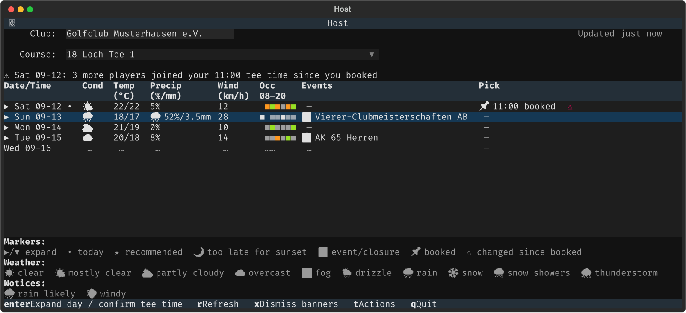
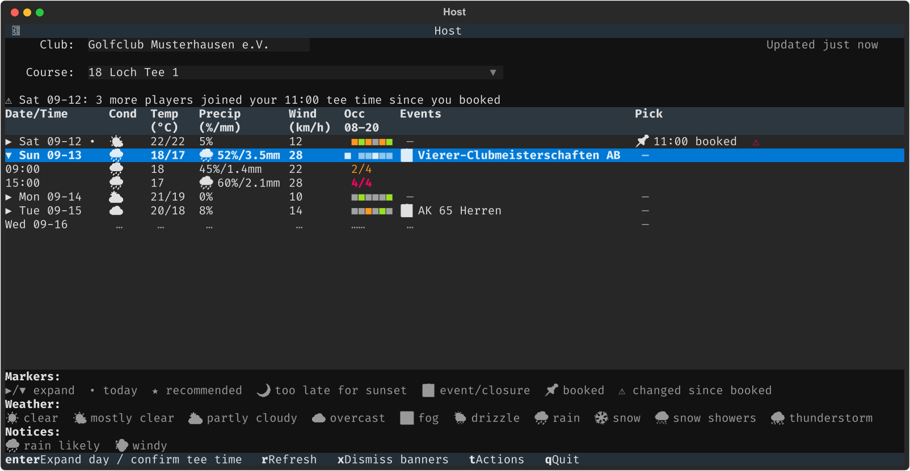
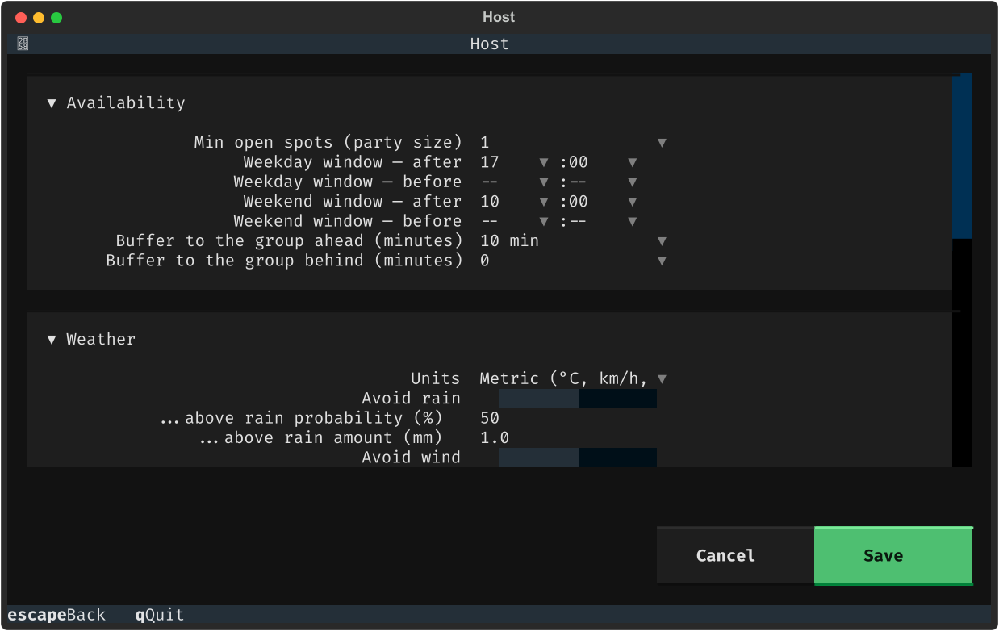
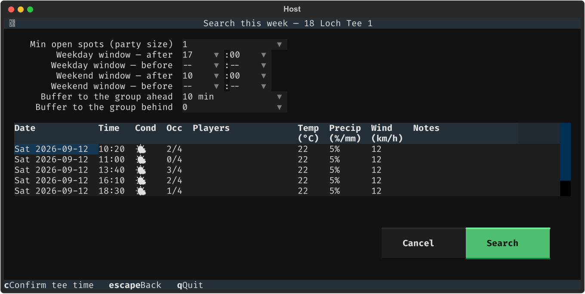
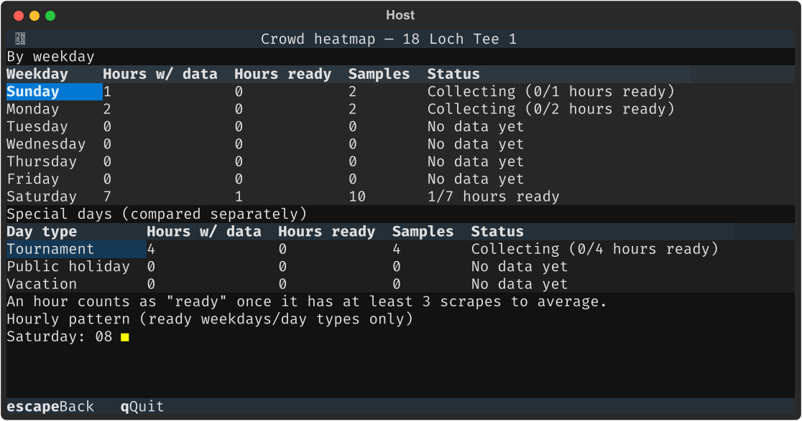
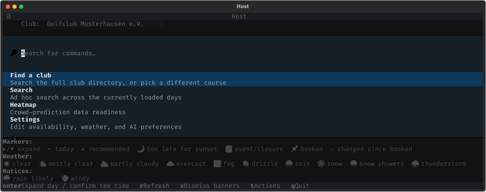

<h1 align="center">teetime-monitor</h1>

<p align="center">
  <strong>Booking a tee time takes a minute. Finding the right one takes all week.</strong><br>
  Your golf club's tee sheet in a terminal — kept current by itself, with the weather,
  the daylight and your own rules already applied, so the slot worth taking is marked
  before you go looking.
</p>

<p align="center">
  <a href="https://github.com/ltdan-88/teetime-monitor/releases"></a>
  <a href="LICENSE"></a>
  
  
</p>

<p align="center">🇬🇧 <strong>English</strong> · <a href="README.de.md">🇩🇪 Deutsch</a></p>

<p align="center"></p>

## What this is

Golf clubs across German-speaking Europe publish their tee sheets — who's booked
onto which slot, which slots are still open — through a booking platform called
**pc caddie**. The sheet is public: no login needed to read it.

`teetime-monitor` reads that sheet and puts it in your terminal. It re-reads it on
its own in the background, layers on the things the club's own page doesn't show —
the forecast for each slot, whether a round would still finish before dark, how
busy that weekday usually gets — and marks the slots that match the rules you set
once.

**It never books anything.** Booking still happens on pc caddie's own site. This is
the part *before* that: deciding which slot you actually want, and noticing when
something about it changes.

## How you'd actually use it

1. **Open it.** You land on the next few bookable days, one row each.
2. **Read the Pick column.** Each day already says what it thinks: a ★ recommended
   time, your confirmed booking, or why nothing there qualifies ("too dark to
   finish", "no dry tee time").
3. **Press enter on a day** to open its actual tee times in place, and enter again
   on one to mark it as yours once you've booked it on pc caddie.
4. **Forget about it.** It keeps scraping in the background. If someone joins your
   flight, the slot next to yours fills in, or the forecast for your round turns,
   there's a banner waiting the next time you open it.

## Quick start

```bash
brew install ltdan-88/teetime-monitor/teetime-monitor
teetime-monitor
```

Type your club's id (or paste its pc caddie booking link) and you're on its tee
sheet. Nothing to configure first, and no account needed — the tee sheet is public.

<details>
<summary><strong>The optional extras, and what each unlocks</strong></summary>

Everything above works with none of these. Each one is additive:

| Add | Unlocks |
|---|---|
| A pc caddie login (`l` in the club browser) | Searching the club directory by name, and reading your own confirmed bookings automatically instead of marking them by hand |
| An [Anthropic](https://www.anthropic.com/) API key | AI-ranked recommendations (off by default; a paid API call per recommendation) |

**Requirements:** macOS or Linux, and [Homebrew](https://brew.sh/).

</details>

On macOS, that same install also builds a native SwiftUI companion app — see
[**A macOS companion app**](#a-macos-companion-app-macos-only) below.

## What you get

### One row per day, already interpreted

Weather split into real columns (condition, temperature, precipitation, wind — via
[Open-Meteo](https://open-meteo.com/), no API key), a six-block strip showing how
full 08:00–20:00 is, that day's events and closures, and the **Pick**: the verdict
for that day.

Press **enter** to open a day in place rather than navigating away from the week.

<p align="center"></p>

### Rules you set once

Party size, the time windows that work on weekdays vs weekends, how much clearance
you want from the groups ahead and behind. Slots matching all of it get a ★
automatically — you never search for the routine case. These are global, not
per-club: your own availability doesn't change depending on which course you check.

A 🌙 marks any tee time whose round wouldn't finish before sunset, based on your own
pace for 9 or 18 holes.

<p align="center"></p>

### Search, for the exceptions

When the usual rules don't apply — "just this once, three of us, after 15:00" —
search across the days already loaded, pre-filled from your defaults so you change
one field instead of typing everything.

<p align="center"></p>

### It keeps watching what you booked

Once a slot is marked as yours, teetime-monitor keeps checking it: players joining
your flight, the neighbouring slot filling up and eating your buffer, the forecast
for that specific round getting worse. Each one becomes a banner the next time you
open the app. **x** dismisses them.

### A crowd heatmap, once there's history

Every scrape is kept, so patterns build up over weeks: which hours on which weekday
actually fill. Tournament, public-holiday and vacation days are compared separately,
so a vacation-week Monday is judged against other vacation days rather than against
normal Mondays.

The grid shows hour-of-day against weekday — full colour once an hour has enough
samples to trust, dimmed while it's still thin, blank where nothing's been scraped.
The tables above it say how far along each weekday is.

<p align="center"></p>

### One menu, two languages, eleven themes

**t** opens **Actions** — find a club, search, heatmap, settings, language, theme.
The whole interface runs in English or German (including this menu and every
banner), and ships eleven colour themes: the same ten as
[`brew-launcher`](https://github.com/ltdan-88/brew-launcher), plus Catppuccin
Latte for anyone who wants a light theme that isn't Solarized.

<p align="center"></p>

## A macOS companion app (macOS only)

`brew install`/`brew upgrade` on macOS also builds a native SwiftUI window over
the exact same data — same club/course, same scrape history, same
`~/.config/teetime-monitor` state, updated by the same background scraper. It's a
second way to look at the same thing, not a second thing to keep in sync by hand.

It covers most of what's above: the day list with weather and a heat strip, ad hoc
search, a crowd heatmap, preferences and pc caddie login, managing which clubs are
saved (add by name or id, remove — both from one place under Settings), scrape
interval and AI ranking, and — same as the terminal — English/German and a choice
of interface scale (Small/Medium/Large in Settings). It never scrapes or books
anything itself; the real work (logging in, searching, scraping) stays in this
same Python codebase, reached the same way the terminal app reaches it.

It doesn't replace the terminal app above — think of it as a prototype exploring
what a native window over the same state could look like, developed alongside the
terminal app rather than instead of it. Homebrew builds it straight into its own
Cellar (a plain `brew install` can't write into `/Applications` — that's normally a
Cask's job), so `brew install`/`upgrade` prints the one command to make it appear in
Launchpad and Spotlight like any other app. See
[`prototypes/macos-swift/README.md`](prototypes/macos-swift/README.md) for the full
build story, including exactly what it can and can't do yet.

## Keys

Almost everything lives behind **t**. These are the keys worth knowing:

| Key | Does | Where |
|---|---|---|
| **enter** | Open a day in place · mark a tee time as booked or cancelled | Overview |
| **r** | Re-scrape the whole loaded window right now | Overview |
| **x** | Dismiss booking-change banners | Overview |
| **t** / **ctrl+p** | Actions — everything else | Overview |
| **escape** | Back (returns to Actions if you came from there) | any screen |
| **q** | Quit | everywhere |
| **f** · **r** · **l** | Favourite a club · refresh the directory · set up your login | Club browser |

`teetime-monitor --version` prints the version; it's also in the header while running.

## Configuration

Nothing here is required — the quick start above works with zero setup.

<details>
<summary><strong>Files, scheduled scraping, running from source</strong></summary>

State lives in two fixed locations, so it works from any directory — and so a GUI
front end can find it too (an app launched from Finder has no useful working
directory). Both are overridable with `TEETIME_MONITOR_CONFIG_DIR` /
`TEETIME_MONITOR_DATA_DIR`.

```
~/.config/teetime-monitor/
    clubs/<club-id>.yaml    # per-club: location, overview_days, default_course
    .env                    # PCC_USER / PCC_PASS / ANTHROPIC_API_KEY
    preferences.yaml        # availability, weather, AI, pace, interval
    config                  # THEME=, LANG=

~/.local/share/teetime-monitor/
    <club_id>.db            # scrape history, confirmed bookings (SQLite)
    club-directory.json     # cached platform club list
```

Upgrading from before v0.31.0? The first launch copies `./clubs`, `./data` and
`./.env` across automatically and tells you what it moved. It copies rather than
moves, so the old directory stays as a backup until you delete it.

Availability and preferences are edited from **Actions → Settings**, not by hand.
`f` on a club writes its YAML for you; `clubs/club.example.yaml` is the annotated
reference (weather coordinates, holiday country code, vacation ranges).

### Keeping history complete

The app scrapes while it's open, but pc caddie deletes past tee sheets — a day
nobody opens the app is a permanent hole in the heatmap. To also scrape unattended
(macOS, every 15 minutes, self-throttling per club):

```bash
cat > ~/Library/LaunchAgents/com.teetimemonitor.scrape.plist <<'EOF'
<?xml version="1.0" encoding="UTF-8"?>
<!DOCTYPE plist PUBLIC "-//Apple//DTD PLIST 1.0//EN" "http://www.apple.com/DTDs/PropertyList-1.0.dtd">
<plist version="1.0">
<dict>
    <key>Label</key><string>com.teetimemonitor.scrape</string>
    <key>ProgramArguments</key>
    <array>
        <string>/opt/homebrew/bin/teetime-monitor-scrape</string>
    </array>
    <key>StartInterval</key><integer>900</integer>
    <key>RunAtLoad</key><true/>
    <key>StandardOutPath</key><string>~/Library/Logs/teetime-monitor.log</string>
    <key>StandardErrorPath</key><string>~/Library/Logs/teetime-monitor.log</string>
</dict>
</plist>
EOF
launchctl load ~/Library/LaunchAgents/com.teetimemonitor.scrape.plist
```

No `WorkingDirectory` needed: since v0.31.0 the scraper reads and writes the same
fixed locations the app does — `~/.config/teetime-monitor/` (clubs, login) and
`~/.local/share/teetime-monitor/` (scrape history) — so it works from anywhere.

Empty log means no errors. Remove with `launchctl unload …` plus deleting the plist.

### From source

```bash
pip install -e .
python -m src.tui
```

</details>

## Project structure

<details>
<summary><strong>Module layout</strong></summary>

```
src/
├── tui.py                    # the app -- club browser, overview, search, heatmap
├── scraper.py                # fetch, login, tee-sheet parsing
├── scrape_once.py            # scheduled scrape + "My Reservations" sync
├── storage.py                # SQLite persistence
├── search.py / recommend.py  # hard filters, then weather/daylight + AI ranking
├── ai_assist.py              # the three Claude calls (classify, rank, summarize)
├── weather.py                # Open-Meteo client
├── booking_watch.py          # did a confirmed booking's situation change?
├── playability.py            # does this round finish before sunset?
├── analytics.py              # crowd heatmap + readiness
├── calendar_context.py       # holidays + vacations -> day type
├── settings_screen.py        # preferences screen (in-app or standalone)
├── credentials_screen.py     # login screen (in-app or standalone)
├── club_config.py            # favourites
├── club_directory.py         # cached club directory + id parsing
├── geocode.py                # weather-location lookup for a new club
├── global_preferences.py     # the shared preferences file
├── theme.py / i18n.py        # themes; English/German UI text
├── units.py                  # metric/imperial
└── models.py                 # Slot / Schedule / WeatherPoint / ConfirmedBooking
```

`ROADMAP.md` carries the full build history, including why several things were
built the way they were.

</details>

## Troubleshooting

**"No tee sheet found" for a club I know exists.** Some clubs don't publish one
through pc caddie at all — that's reported cleanly rather than as an error. Check
the club id against its own booking link.

**The weather looks wrong.** Coordinates come from a name search against
OpenStreetMap, cached after the first lookup — close, but not always the clubhouse
itself. Set `location:` in `clubs/<id>.yaml` by hand to fix it exactly.

**A booking I made isn't showing.** Confirmed bookings sync from pc caddie's "My
Reservations" on each scheduled scrape, not live — **r** forces it immediately. A
cancellation on the real site is picked up the same way.

**AI ranking isn't doing anything.** It's off by default (Settings → AI ranking) and
needs `ANTHROPIC_API_KEY` in `.env` regardless.

**The heatmap is all "no data yet".** Expected on a new install — it needs a few
weeks of scrapes. The readiness tables show how far along it is.

## Credentials

`.env` is gitignored, and credentials only ever go to pc caddie's own login form.
One login covers every club under the same account. Per-club files under `clubs/`
are gitignored too, apart from the tracked example.

## License

[MIT](LICENSE)
